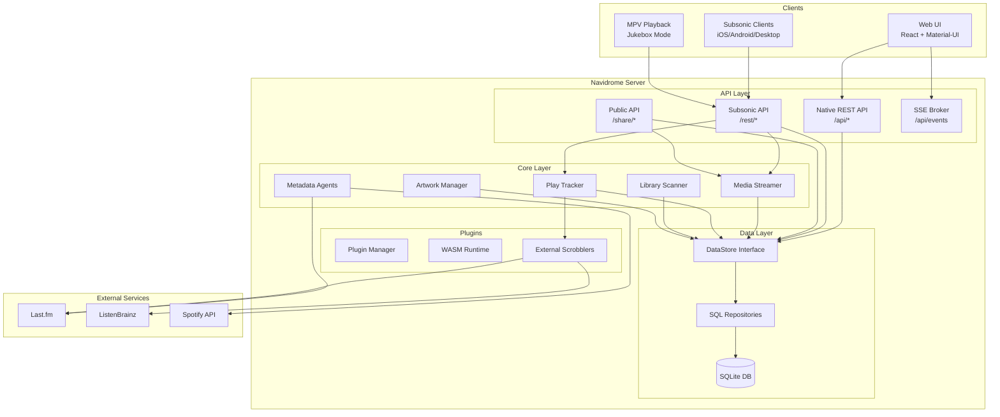
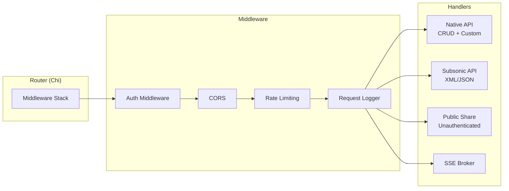
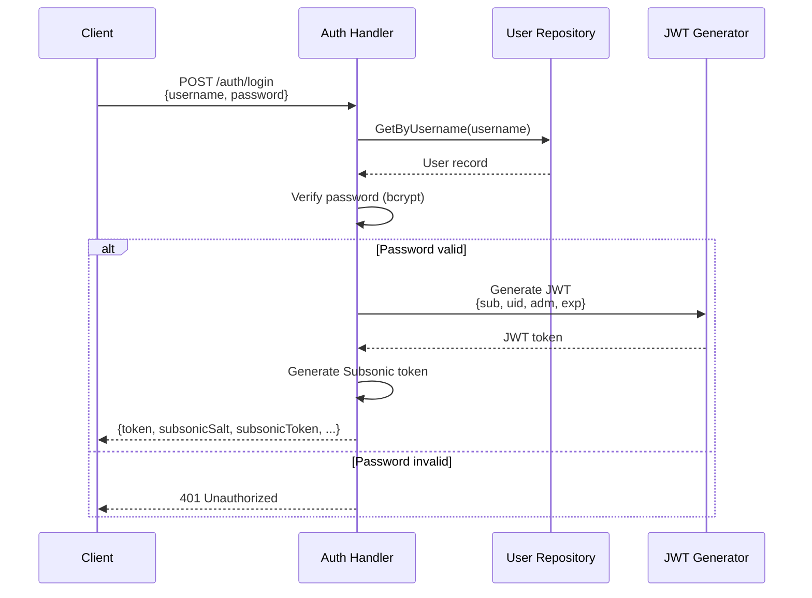
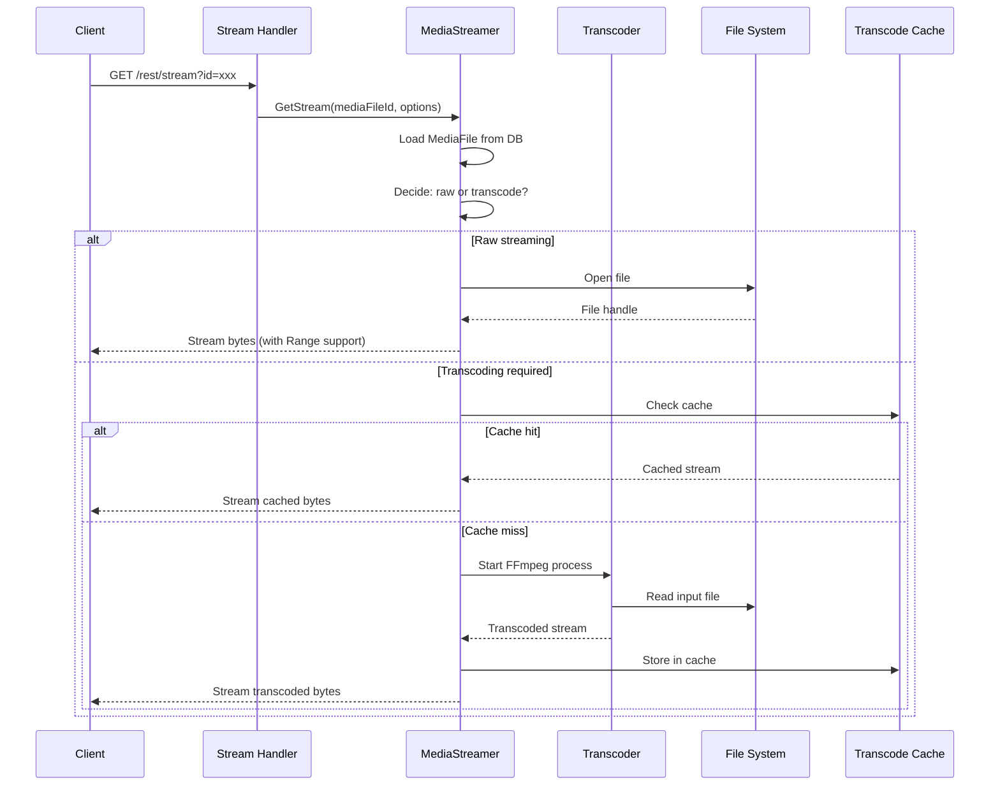
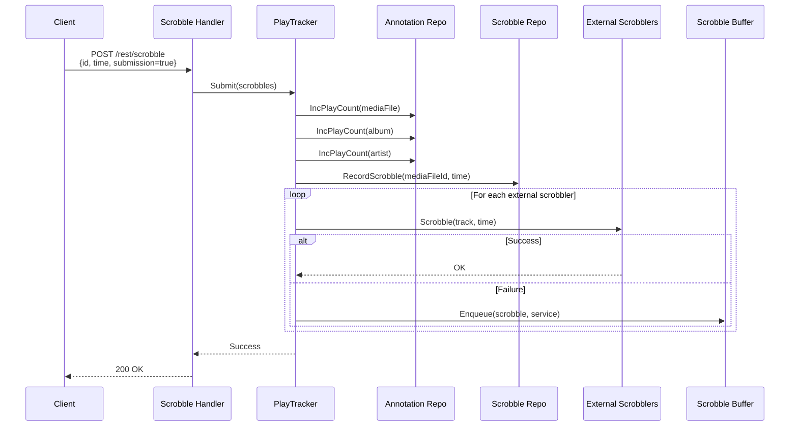
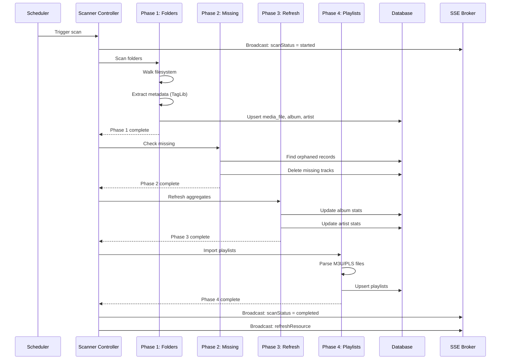
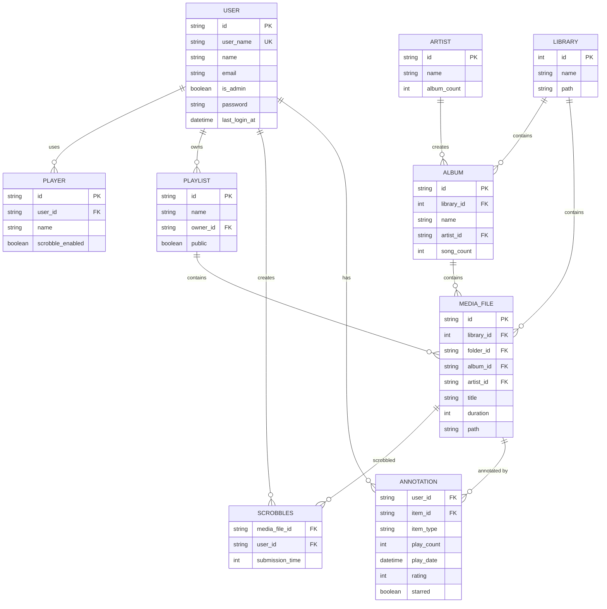
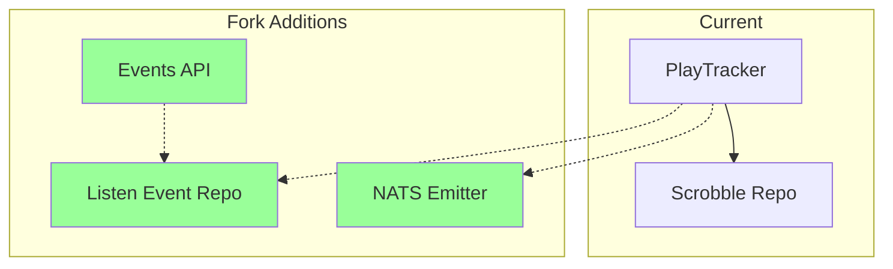
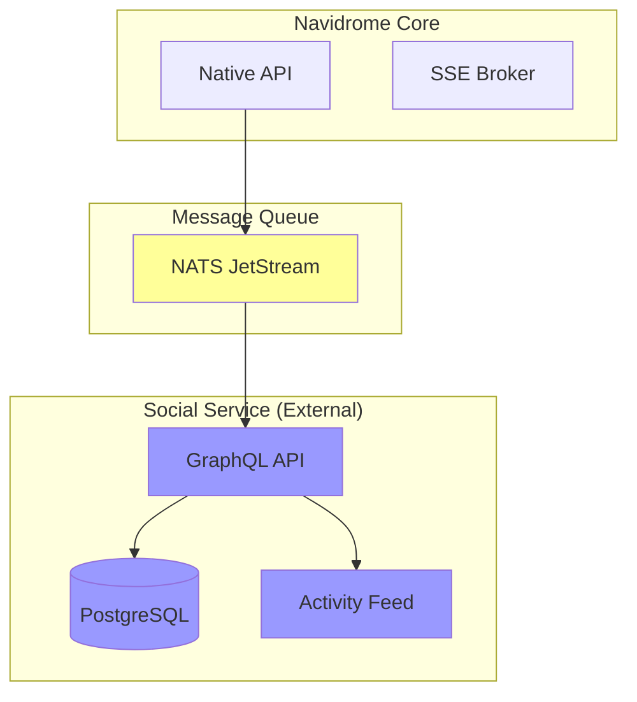

# Architecture Map

This document provides detailed architecture diagrams and data flow documentation for the Navidrome codebase.

## System Overview

### High-Level Architecture

## Component Details

### API Layer

### Data Flow: Authentication

### Data Flow: Track Streaming

### Data Flow: Scrobble Submission

### Data Flow: Library Scan

## Database Schema

### Entity Relationship Diagram

## Extension Points

### For Telemetry (Phase 2)

### For Social Features (Phase 3)

## Key Files Reference

### Core Components

| Component | Primary File | Purpose |
|-----------|--------------|---------|
| Entry Point | `cmd/root.go` | Application bootstrap |
| Configuration | `conf/configuration.go` | Config parsing |
| DataStore | `model/datastore.go` | Repository interfaces |
| PlayTracker | `core/scrobbler/play_tracker.go` | **Telemetry ingestion point** |
| MediaStreamer | `core/media_streamer.go` | Audio streaming |
| Scanner | `scanner/controller.go` | Library scanning |

### API Handlers

| API | Primary File | Auth |
|-----|--------------|------|
| Native REST | `server/nativeapi/native_api.go` | JWT |
| Subsonic | `server/subsonic/api.go` | JWT or Token |
| Public | `server/public/public.go` | None |
| SSE | `server/events/broker.go` | JWT |

### Database

| Component | File | Purpose |
|-----------|------|---------|
| Connection | `db/db.go` | SQLite connection |
| Migrations | `db/migrations/*.sql` | Schema evolution |
| Repositories | `persistence/*.go` | SQL implementations |

## Performance Characteristics

### Request Latency (Typical)

| Operation | P50 | P95 | P99 |
|-----------|-----|-----|-----|
| Auth (login) | 50ms | 100ms | 200ms |
| List albums | 10ms | 50ms | 100ms |
| Stream (raw) | 5ms | 20ms | 50ms |
| Stream (transcode) | 200ms | 500ms | 1s |
| Scrobble | 20ms | 50ms | 100ms |
| Full scan (1000 tracks) | 30s | 60s | 120s |

### Resource Usage

| Scenario | CPU | Memory | Disk I/O |
|----------|-----|--------|----------|
| Idle | <1% | 50MB | Low |
| 10 concurrent streams | 10-30% | 100MB | Medium |
| Full scan | 50-100% | 200MB | High |

## Security Considerations

### Authentication

- JWT with HS256 signature
- Session timeout configurable
- Rate limiting on login endpoint

### Data Access

- All queries scoped by user ID from context
- Admin flag checked for sensitive operations
- Shared content requires explicit share records

### Plugin Sandboxing

- WASM isolation
- Limited host services
- No direct filesystem access

## References

- [ARCHITECTURE_SNAPSHOT.md](../../ARCHITECTURE_SNAPSHOT.md) - Detailed codebase analysis
- [Navidrome Documentation](https://www.navidrome.org/docs/)
- [Subsonic API Documentation](http://www.subsonic.org/pages/api.jsp)
